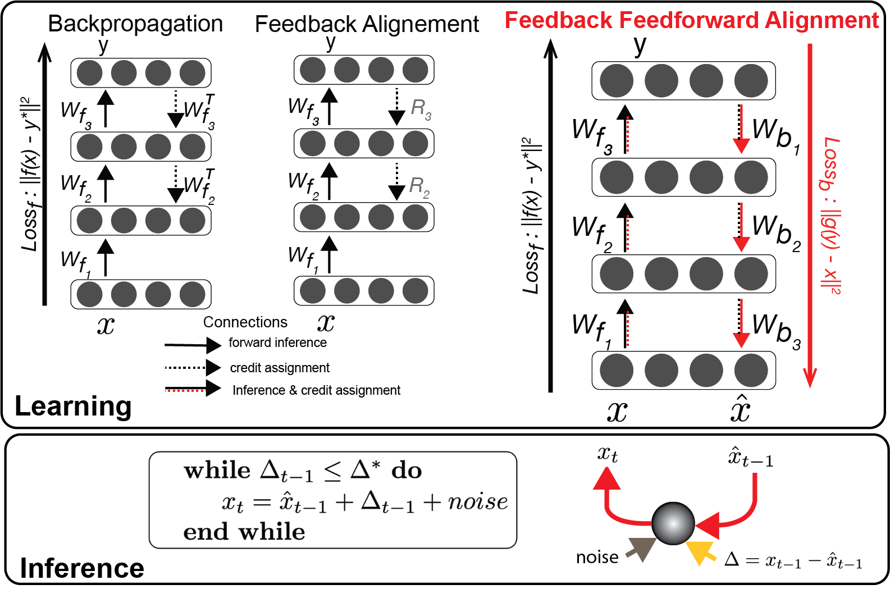

# Feedback_Feedforward_Alignment
Code for NeurIPS2023 paper: Brain-like Flexible Visual Inference by Harnessing Feedback Feedforward Alignment

# Feedback feedforward alignment
This repository is the official implementatin of "Brain-like Flexible Visual Inference by Harnessing Feedback Feedforward Alignment" appeared in [NeurIPS 2023](https://neurips.cc/virtual/2023/poster/72387).

## Learning phase (Training)

The checkpoints are 
|         | FFA                | BP                        | FA                        | checkpoints link                                                                                    |
|---------|--------------------|---------------------------|---------------------------|-----------------------------------------------------------------------------------------------------|
| MNIST   | discr=98.87%, recons=0.98 | discr=99.47%, recons=0.02 | discr=97.51%, recons=0.01 | [download](https://drive.google.com/drive/folders/1iGxrVyOvwn_Qkeg0BigzqChdREMetAkG?usp=drive_link) |
| CIFAR10 | link1              | link1                     | link1                     | link CIFAR10                                                                                        |
|         |                    |                           |                           |                                                                                                     |

## Validation
To generate figures for training evaluation 
FeedbackFeedforwradAlignment/Generate_Figures/Fig2_Training_results.ipynb
To generate figures for robustness evaluation
FeedbackFeedforwradAlignment/Generate_Figures/Fig3_robustness_evaluation.ipynb
1. Accuracy

2. Reconstruction performance

3. Alignment

4. Noise robustness

5. Adversarial robustness
## Inference phase (brain-like flexible visual inference)

## Citation

